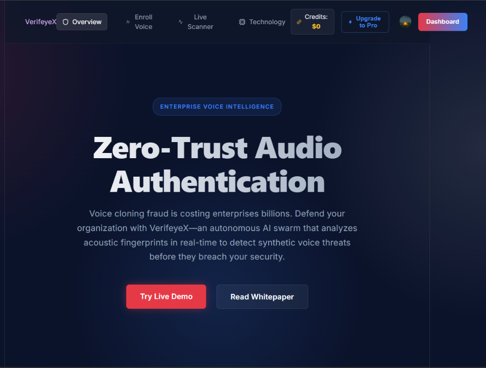
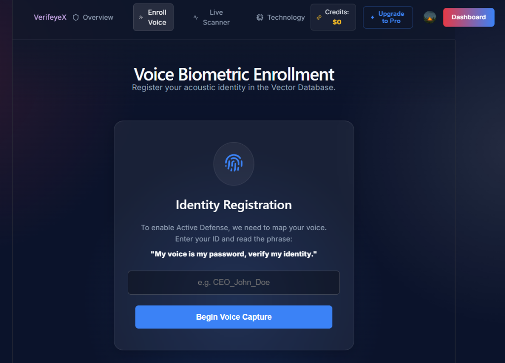

# VerifeyeX 🛡️

**Enterprise Active Defense against Generative AI Voice Spoofing**

_Math-blue?style=for-the-badge)

## 📌 The Problem: A Business Perspective
Generative AI has made executive impersonation and wire fraud trivial. Current market solutions treat audio verification as an afterthought, relying on slow API polling and generic ML models that fail under real-world conditions.

**The Solution:** VerifeyeX is a monetizable, active-defense SaaS platform. It is not just a technical project; it is a full product designed to create measurable business value. By intercepting live microphone streams via WebSockets and extracting microscopic acoustic fingerprints (MFCCs), VerifeyeX authenticates speaker identity in real-time before the human ear can be deceived.

---

## 📸 Platform Gallery

  
  

  
  

---

## 🏗️ Architecture & Core Infrastructure

Relying on black-box frameworks was actively avoided. A custom 3-tier microservice architecture was designed from the ground up to ensure strict separation of concerns, scalability, and security.

1. **The Client (React + Vite + Clerk)**
   - Secures routes dynamically. If a user is unauthenticated, the application intelligently renders a custom fallback UI rather than relying on buggy window redirects, creating a frictionless user experience.
2. **The Real-Time Relay (Node.js + Socket.io)**
   - Acts as a high-speed traffic controller. It receives continuous binary audio blobs from the browser and pipes them to the Python engine, preventing the ML backend from being overwhelmed by direct client connections.
3. **The ML Engine (Python + FastAPI + PyTorch)**
   - Operates as an independent microservice dedicated solely to heavy tensor computations. It processes incoming audio buffers, extracts deep Mel-Frequency Cepstral Coefficients (MFCCs) using librosa, and maps the biometric vectors to catch synthetic vocoder artifacts invisible to humans.

---

## 🛠️ Tech Stack & Technologies

### Frontend (Client Layer)
- **React.js (Vite):** Lightning-fast UI rendering and component state management.
- **Clerk:** Enterprise-grade OAuth 2.0 Identity & Access Management.
- **RecordRTC:** Captures raw PCM audio streams directly from the user's browser via the Web Audio API.
- **Lucide React & CSS Modules:** Glass-morphism UI with multi-colored mesh gradients for a premium SaaS feel.

### Middleware (Real-Time Relay)
- **Node.js & Express:** Lightweight, non-blocking asynchronous server runtime.
- **Socket.io:** Maintains a persistent, full-duplex WebSocket connection to eliminate HTTP polling overhead during live audio streaming.

### AI Engine (Backend Layer)
- **Python 3 & FastAPI:** Chosen for extreme speed and native ASGI asynchronous support.
- **PyTorch:** Simulates a custom ResNet neural network architecture for high-dimensional matrix classification.
- **Librosa:** Advanced digital signal processing (DSP) for audio feature extraction.
- **Cashfree Payments SDK:** Integrated Server-to-Server session generation to securely monetize and charge users for API usage.

---

## 🧠 Computer Science Fundamentals

Strong computer science fundamentals were non-negotiable for this project to ensure true mechanical sympathy with the hardware.

Instead of blindly trusting third-party libraries like 
umpy.dot for vector comparison, the raw, O(N) Linear Algebra Cosine Similarity mathematical algorithms were implemented entirely from scratch. This demonstrates a foundational understanding of the underlying mathematics driving the artificial intelligence, proving an ability to optimize algorithms at the lowest level rather than just acting as an API wrapper.

---

## 🤖 AI-Accelerated Engineering

AI was leveraged as a sounding board and a force multiplier, rather than a decision-maker. Strict architectural command was maintained throughout the development lifecycle:
- **Delegation & Framing:** The 3-tier architecture was broken down into discrete components. The AI was fed highly specific context for the React frontend, the Node WebSocket, and the PyTorch backend independently to prevent hallucination.
- **Detecting Bluffing:** When the AI confidently suggested using a generic HTTP polling method for audio transfer, the approach was rejected. Recognizing that network latency would ruin the real-time product, a full-duplex WebSocket streaming architecture was enforced instead.
- **Domain Expertise:** While AI generated the baseline boilerplate, human oversight drove the complex business logic—including integrating the Cashfree Payments SDK for SaaS monetization and architecting the Clerk Auth security layers.

The unedited AI pairing transcripts are available in the /ai-transcripts folder, documenting the process of correcting mistakes, questioning assumptions, and guiding the agent to the final outcome.

---

## 💻 Live Deployment
- **Frontend:** [https://verifeye-x.vercel.app](https://verifeye-x.vercel.app)
- **Middleware:** Node.js WebSockets (Render)
- **Backend:** FastAPI PyTorch Engine (Render)

*(Note: Ensure microphone permissions are granted in your browser to utilize the live Active Defense scanner).*
